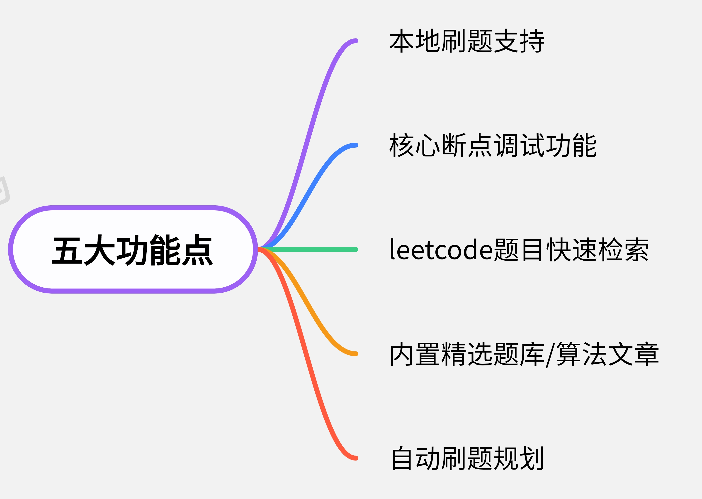

`Leetcode-runner`是一款开源的Jetbrain产品插件。旨在实现一个核心功能完备，且简洁容易上手的Leetcode刷题插件。插件支持日常刷题所需的一切功能，如**代码编写**、**代码运行/提交**、**测试案例更换**、**运行结果显示**、**题解展示**、**提交记录展示**、**代码替换**、**测试案例替换**等功能，实现脱离Web端刷leetcode

此外，插件项目还提供另外三个极为强大的功能。分别是**大批量题目快速检索**、**核心代码断点调试**、**深度刷题**

## 📖 功能模块

LR在v3.7.0版本中, 对外提供五大功能.

### 本地刷题支持
作为一款Jetbrains IDE插件，它提供了本地刷题的支持，即在IDE中直接编写代码，并提交到Leetcode平台进行测试和运行。

插件支持代码编写，测试案例设置，运行结果可视化，题目查看，题解查看，提交记录查看等诸多功能。

### 核心断点调试功能
Leetcode题目都是核心代码模式，即只给出Solution，而没有main函数。这使得调试变得更加困难，因为无法直接运行代码。如果用户想要调试，需要手动编写**大量多余代码**，手动将测试案例转换为对应代码。如果遇到链表或者二叉树等复杂数据结构，**极容易出错**。

为了解决这一问题，Leetcode-Runner**内置调试系统**，<u>支持多种语言，无需额外编码，一键调试Solution代码</u>。

此外，针对不同的数据结构，Leetcode-Runner还对数据进行优化。譬如Java的Map，Set，LinkedList等数据结构，给出更为人性化的显示方案。

**java**

**java**

**python**

**cpp**

## 🌐 仓库地址

[Leetcode-runner Github](https://github.com/xuhuafeifei/leetcode-runner)

## 😎 我们的优势

1. **去客户端SDK支持：** 为了方便开发者集成接口到自己的代码中，平台提供了客户端SDK，使调用接口变得更加简单和便捷。

2. **简洁高效：** 稳定、安全、高效的接口调用服务，帮助您实现更快速、便捷的开发和调用体验。

## 🏗️ 参与贡献

欢迎各路好汉一起来参与完善 Leetcode-runner，我们期待你的 PR！

- 贡献代码：代码地址 [Leetcode-runner](https://github.com/xuhuafeifei/leetcode-runner)，欢迎提交 Issue 或者 Pull Requests
- 维护文档：文档地址 [Leetcode-runner-doc](https://github.com/itxaiohanglover/leetcode-runner-doc)，欢迎参与修订