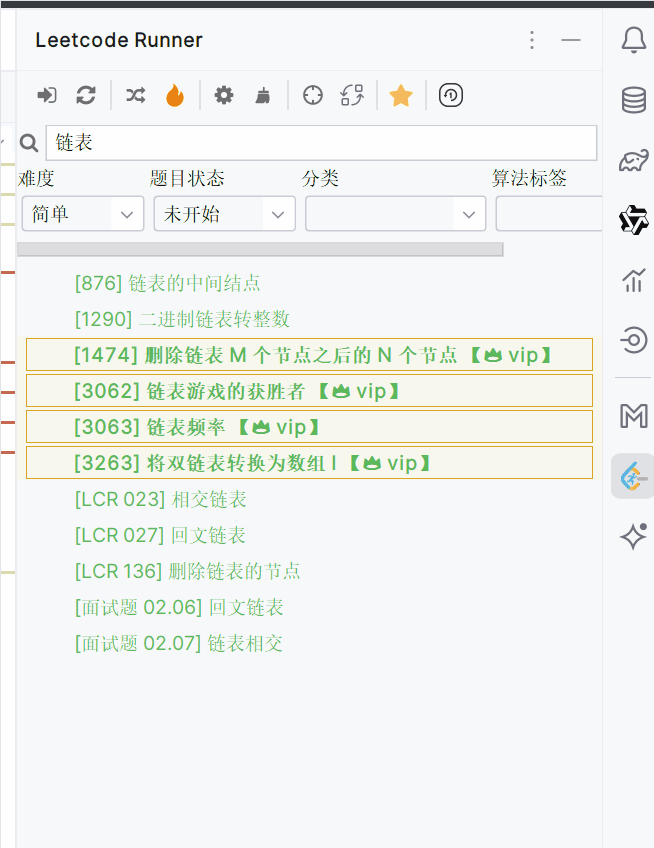

`Leetcode-runner`是一款开源的Jetbrain产品插件。旨在实现一个核心功能完备，且简洁容易上手的Leetcode刷题插件。插件支持日常刷题所需的一切功能，如**代码编写**、**代码运行/提交**、**测试案例更换**、**运行结果显示**、**题解展示**、**提交记录展示**、**代码替换**、**测试案例替换**等功能，实现脱离Web端刷leetcode

此外，插件项目还提供另外四个极为强大的功能。分别是**大批量题目快速检索**、**核心代码断点调试**、**深度刷题**、***自动规划刷题(预计在v3.7.0版本上线)**

## 📖 功能模块

### 本地刷题支持
作为一款Jetbrains IDE插件，它提供了本地刷题的支持，即在IDE中直接编写代码，并提交到Leetcode平台进行测试和运行。

插件支持代码编写，测试案例设置，运行结果可视化，题目查看，题解查看，提交记录查看等诸多功能。

### 核心断点调试功能
Leetcode题目都是核心代码模式，即只给出Solution，而没有main函数。这使得调试变得更加困难，因为无法直接运行代码。如果用户想要调试，需要手动编写**大量多余代码**，手动将测试案例转换为对应代码。如果遇到链表或者二叉树等复杂数据结构，**极容易出错**。

为了解决这一问题，Leetcode-Runner**内置调试系统**，<u>支持多种语言，无需额外编码，一键调试Solution代码</u>。

此外，针对不同的数据结构，Leetcode-Runner还对数据进行优化。譬如Java的Map，Set，LinkedList等数据结构，给出更为人性化的显示内容。

**java**

 
 

**python**
> idea中调试python，无需切换IDE

 
 

**cpp**
> idea中调试cpp，无需切换IDE

## leetcode题目快速检索
leetcode-runner为了提高题目检索效率, 废弃复用leetcode平台接口的这一技术方案, 转而开发本地的搜索服务, 以此提高查询效率

## 内置精选题库/算法文章
leetcode平台一共拥有接近4000道题目, 初学者并不清楚有哪些题目适合自己，盲目的刷题不仅不利于专项能力的提高，更会消耗自己对算法热情，无法将刷题作为一个长期坚持的习惯，从长远来看，会让自己对算法产生畏惧。为了解决这一问题，leetcode-runner内置多个精选题库，并提供个性化UI界面，**极大的提高用户的刷题的质量与效率**。

leetcode-runner内置的精选题库有：

- Leetcode热门100题
- 经典面试150题
- 竞赛题目

 
 

对于竞赛题目, Leetcode-Runner展示每一道`题目对应的难度分`和`解决题目所需要的算法`。需要说明的是，所谓的`难度分`是指想要解决某一道题目，用户需要具备的`最低leetcode竞赛分数`。比如说某道题目的难度分是3000分，如果用户当前的leetcode竞赛分是1900，远远低于3000，那么这道题目明显不适合当前用户。用户应该通过筛选功能选择`1900~2100`分的题目。另外，如果用户想要专门练习`动态规划`算法，可以在**算法筛选**中选择`动态规划`。

 
 
值得一提的是，Leecode-Runner专门集成了灵神(算法大牛)的算法文章，用户可自行选择是在插件中浏览还是跳转到leetcode官网观看。

 

此外插件对于灵神文章中出现的链接做出额外优化，如果链接指向的是题目，则会在Leetcode-Runner中打开。

 
 

## 自动刷题规划
在刷题时，遇到不会的题目我们可能需要很长时间才能解决，即使最终解决题目，这也并不意味着你真的掌握了它。人的记忆是会衰减的，可能过了一段时间后你又发现你完全没有思路。想要真正理解并掌握某一道题目，需要不断的重复巩固。然而，市面上并没有别的插件会将题目集成，规划下一次复习时间，这一切都需要用户手动记录，于用户而言很不友好。

为了解决这一问题，Leetcode-Runner引入review功能，允许用户将刷过的题目添加到复习题单，系统会**自动规划**下一次做题时间，并且复习时间的规划符合`记忆遗忘曲线`。通过不断重复，帮助用户真正掌握某一道题目。

目前该功能正处于**开发阶段**，预计将在`v3.7.0版本`上线。

> 功能示意览图

## 🌐 仓库地址

[Leetcode-runner Github](https://github.com/xuhuafeifei/leetcode-runner)

## 🏗️ 参与贡献

欢迎各路好汉一起来参与完善 Leetcode-runner，我们期待你的 PR！

- 贡献代码：代码地址 [Leetcode-runner](https://github.com/xuhuafeifei/leetcode-runner)，欢迎提交 Issue 或者 Pull Requests
- 维护文档：文档地址 [Leetcode-runner-doc](https://github.com/itxaiohanglover/leetcode-runner-doc)，欢迎参与修订