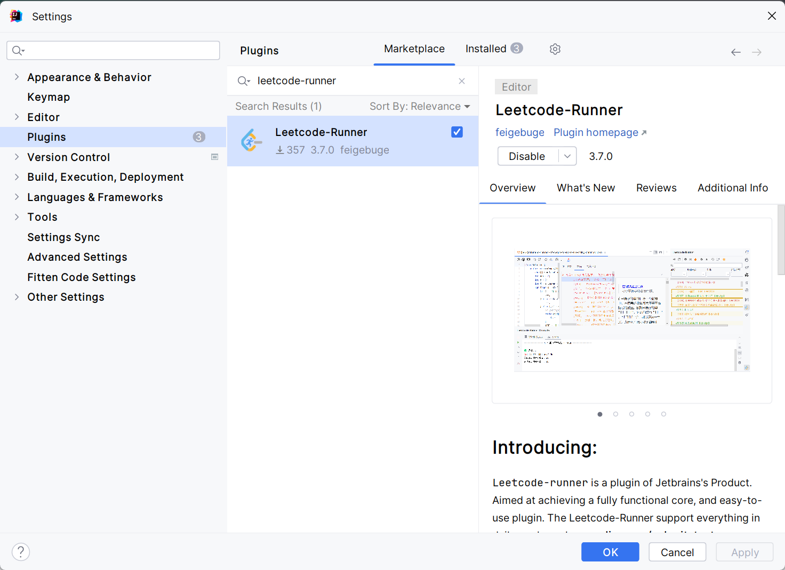
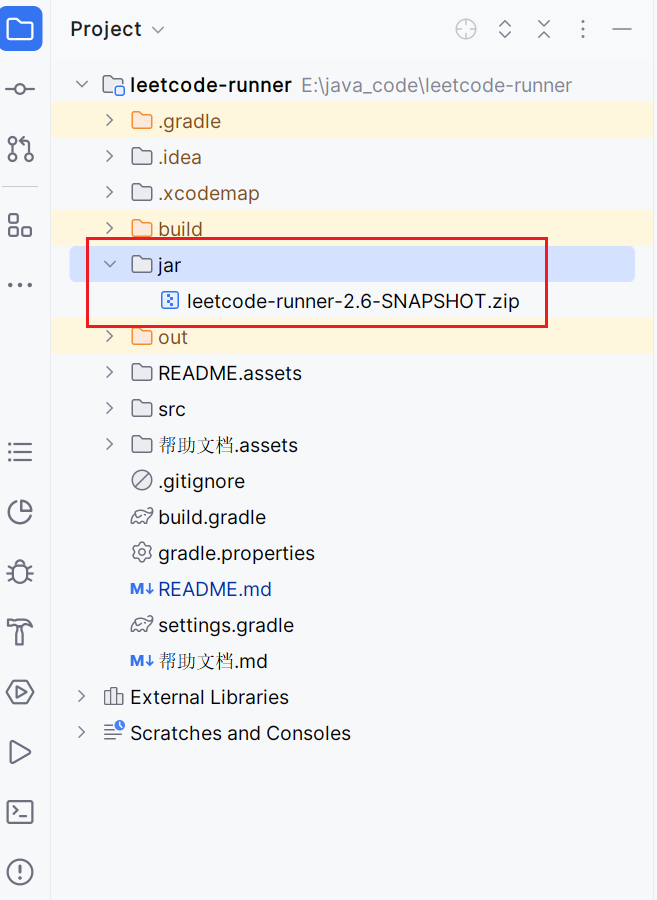
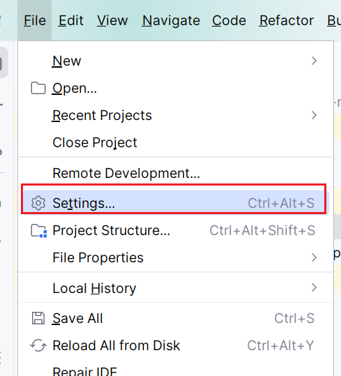
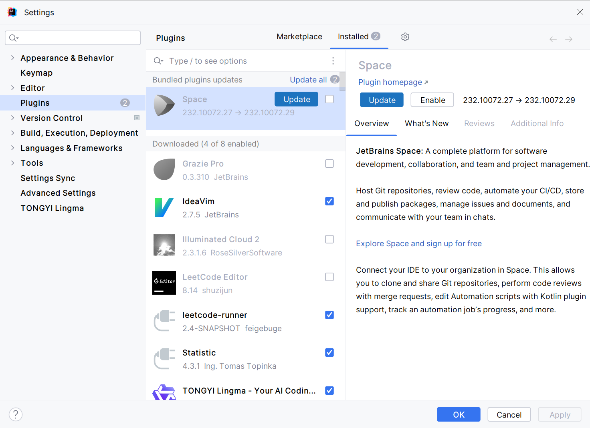
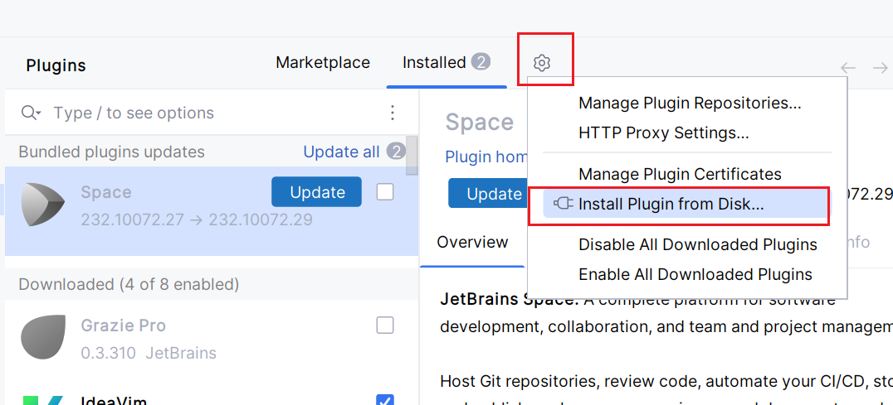
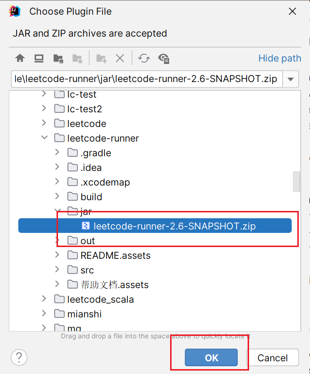
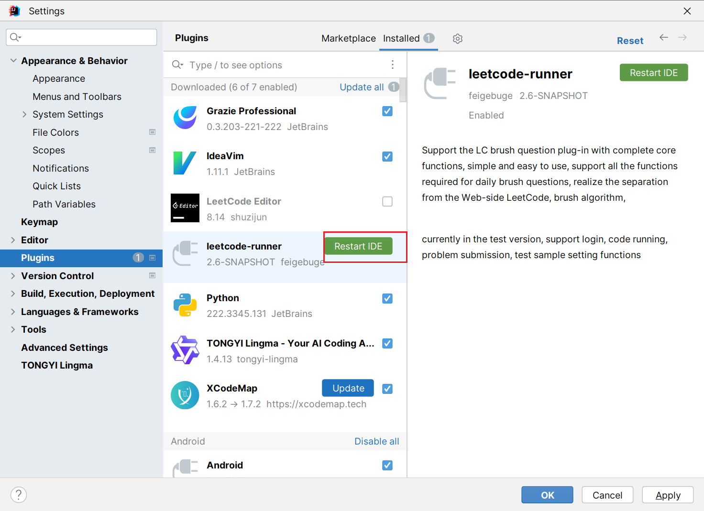

## Jetbrains插件市场安装
打开Jetbrains插件市场，搜索`Leetcode Runner`，点击安装

## 从磁盘中加载插件

### 选择对应插件版本的jar包

在根目录下找到/jar/目录，里面有打包好的插件jar包【或者可以自行通过gradle打包项目】

 
 

### 打开插件设置界面

打开自己的idea，File->Settings->Plugin，打开插件设置界面

 

 
 

### install plugin fron disk

点击齿轮图标，选择从disk安装plugin

 
 

### 选择插件jar包

选择第一步获取的jar包，点击确定

 
 

### 安装成功

当出现Restart IDE按钮时，就表示插件安装成功！

