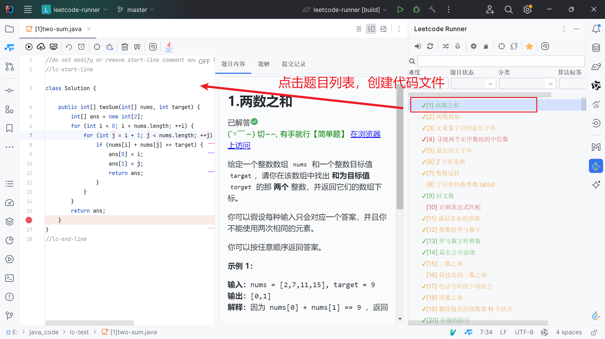

### 加载插件

插件项目启动后，会出现两块工具栏

如果没有出现，可以通过`View -> Tool Windows -> Leetcode Console Plugin / Leetcode Plugin` 打开工具窗口

### 插件初始化

- 打开设置栏

   

- 选择`编程语言`和`存储路径`

   

   > 编程语言: 指定当前用何种语言解决问题
   > 存储路径: 指定code文件创建的目录
   >
   > <u>tip: 有关各种设置的介绍，可以通过最右侧的问号图标得到解答</u>

3. 点击登录按钮，进行登录操作

   

4. 正常情况下，插件会模拟浏览器，出现leetcode官网登录界面，具体如下

   

   如果登录成功，则会加载数据内容，并在右侧的工具栏中出现问题内容

> tip: 第一次登录需要加载所有题目，这可能会耗费3-5s左右的时间，在此期间会在后台加载数据，并锁定部分功能。这是正常行为

### 代码编写

点击右侧问题内容，插件会创建代码文件，并进行问题内容预览

编辑栏**右上角**存在三个按钮

第一个按钮，会隐藏右侧内容，只留下代码部分

第二个按钮，保留左右两侧所有的内容

第三个按钮，会隐藏左侧代码编辑区域，只留下右侧部分

### 运行代码

编辑栏左侧存在多个个按钮，前三个和代码运行有关。后七个将在`其他功能`中进行介绍

 

第一个按钮，运行代码，使用题目的默认测试样例运行代码（快捷键ctrl + alt + 9）

 

第二个按钮，提交代码，将代码提交到leetcode运行（快捷键ctrl + alt + 0）

 

第三个按钮，Test Cases，设置测试案例

 

点击第一、第二个按钮后，会在**插件自带的控制台**输出执行信息

 
第三个按钮，会出现弹框，可以自定义测试数据

> Reset按钮可以恢复题目的默认测试样例
