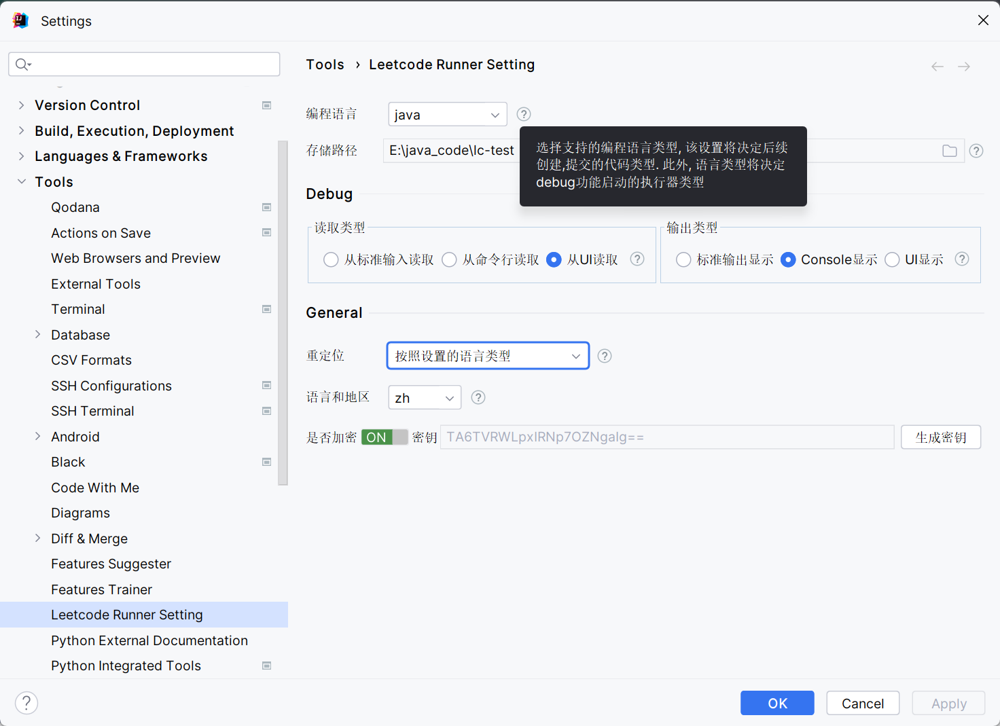
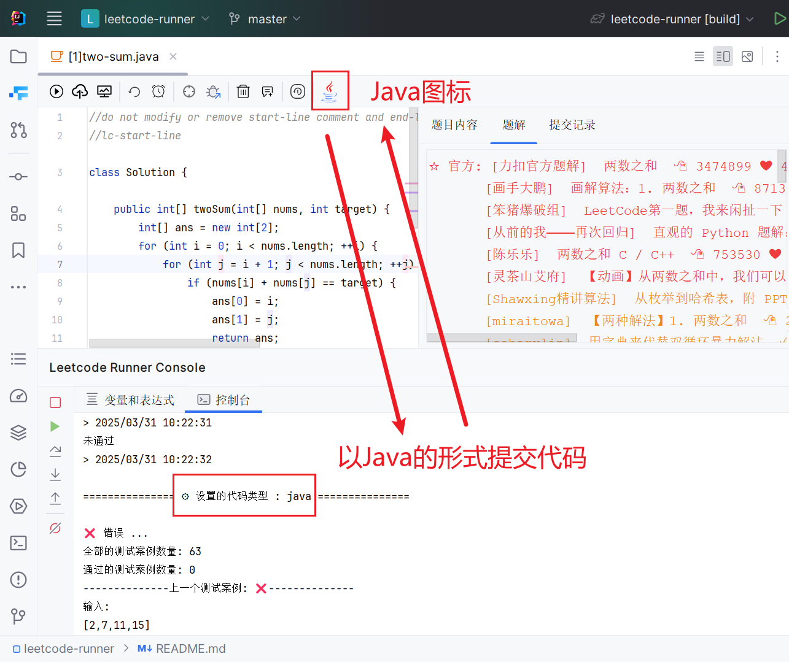
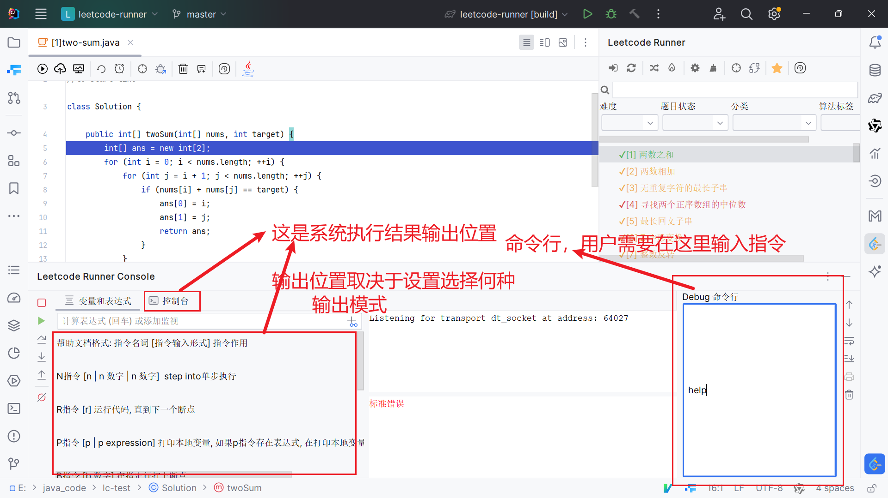
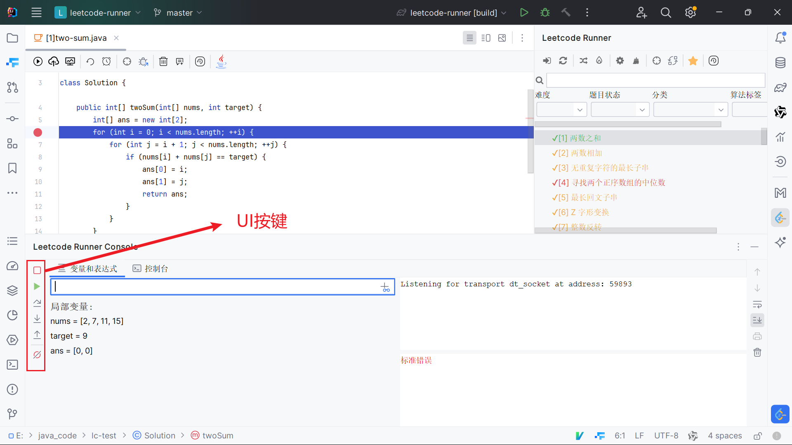
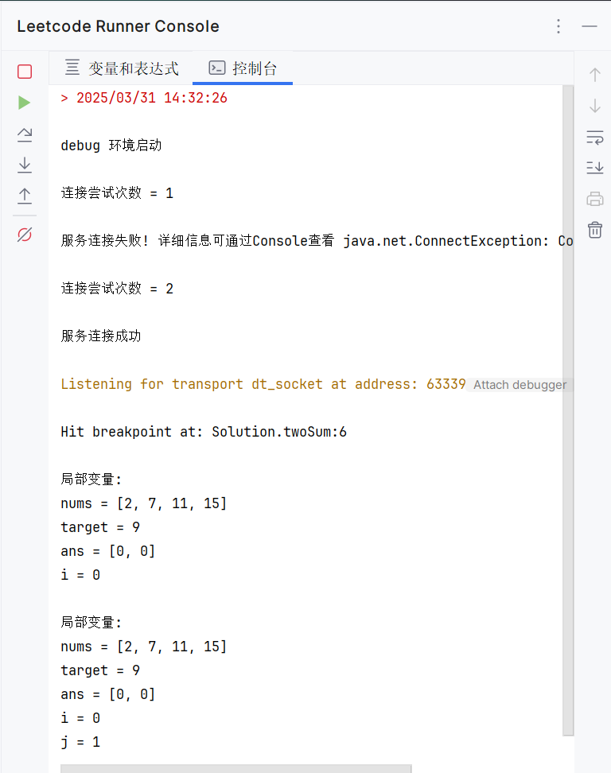
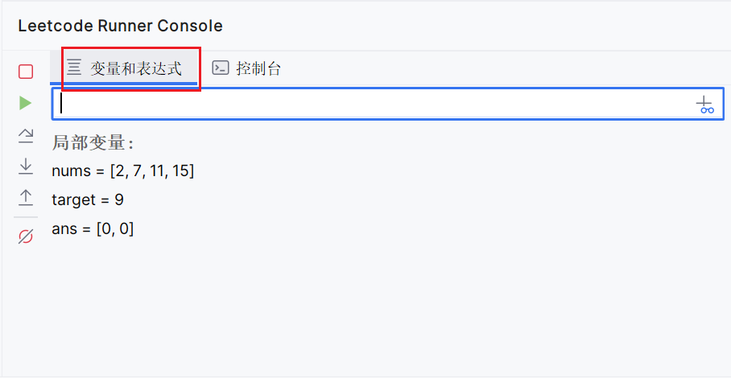

在初次使用插件时，系统会强制弹出`设置界面`，要求用户完善设置信息。对于每一个设置选项，Leetcode-Runner都对其做出详细介绍。用户只需要将鼠标移动至每一行末尾的**问号图标**，即可查看该选项的详细信息。

## 编程语言
指定当前使用何种编程语言刷leetcode算法。该按钮决定系统会创建什么类型的代码文件，最终是以什么形式将题目传给leetcode平台进行判题。

假如用户选择的是`java`，则系统会创建`java`文件，并且在编码栏最顶部显示java的图标。

用户提交代码后，在Leetcode-Runner控制台处也会显示当前选择的语言类型

## 存储路径
指定code文件创建的目录。该目录决定了系统在本地创建code文件的存储位置。

假如用户选择的是`D:\code`，则系统会在`D:\code`目录下创建code文件。

值得一提的是，在当存储路径确定后，系统会自动创建一个名为`cache`的文件夹，其中存储Leetcode-Runner的缓存文件。并且cache生成路径只取决于用户`第一次选择的存储路径`，哪怕后续用户更改目录，缓存文件也不会移动。

## Debug配置
该配置信息只会在用户进行debug时检查。Leetcode-Runner推荐全部采用带有UI的默认配置。

### 读取类型

**从命令行读取**

读取类型，决定Debug系统是如何接受用户下达的Debug命令。如果先择的是`从命令行读取`，那么要求用户从command命令行输入指令，以此实现和Debug系统的交互

这种读取方式的劣势是，用户需要在命令行中输入指令，要求用户熟悉我设计的这套debug系统的命令语法。

好处是跨语言，对于Idea，它并不支持python代码，这会导致用户**无法在idea中为python代码打上断点**。但指令系统完全**摆脱IDE的限制，可以跨语言断点调试**。

 

**从UI读取**

如果选择的是`从UI读取`，那么要求用户在Debug系统的UI界面中输入指令，以此实现和Debug系统的交互

 
 

### 输出类型
**Console显示输出**

所有debug产生的数据信息全部写入Console控制台中

 

**UI显示输出**

所有debug产生的数据信息全部写入`UI界面`/`变量和表达式`中(在该模式下，系统会同步高亮正在执行的代码)

## General
额外配置信息，为用户提供额外的功能，让使用者有着更好的系统使用体验。

### 重定位

该功能决定点击`重定位`按钮后，系统将会打开什么样的文件。

如果用户选择的是`按照文件代表的语言类型`，那么系统重定位后会重新打开文件。比如用户当前打开的文件是`[1]two-sum.java`，重定位后依然会打开`[1]two-sum.java`。

如果用户选择的是`按照设置的语言类型`，那么系统重定位后打开的文件类型取决于系统设置的语言。比如用户打开的是`[1]two-sum.java`，但是系统设置的语言是`python`，那么重定位后会打开`[1]two-sum.py`。

### 语言和地区
该功能决定打开Leetcode-Runner后，是以何种语言显示。默认zh，也就是中文

### 是否加密
Leetcode-Runner对于用户信息，会做出加密操作。该功能默认关闭。如果想要使用该功能，用户必须`手动开启`该功能并点击`生成密钥`按钮，生动创建密钥。

此外，如果用户在系统使用过程中创建密钥，可能会导致原有的缓存数据失效。