## 恢复默认代码

恢复默认代码，能将当前打开的文件按照设置的语言恢复为默认代码

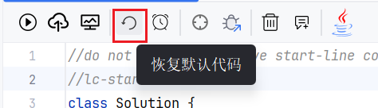

 

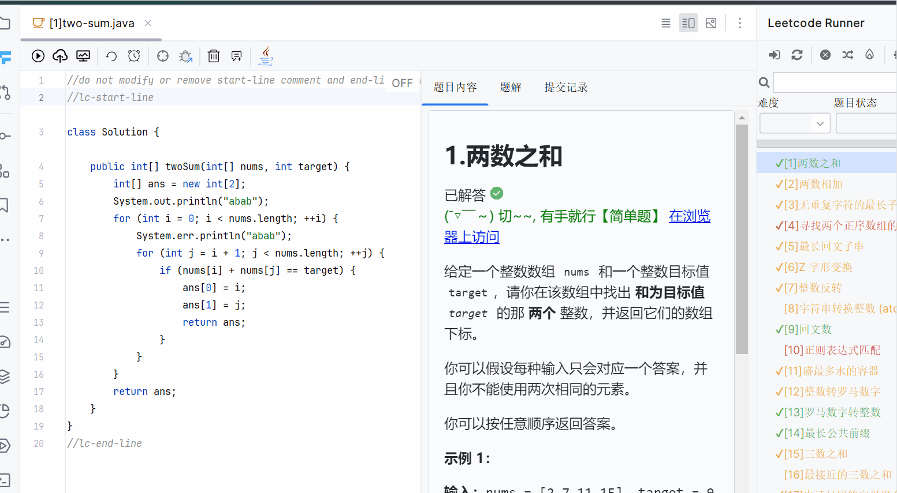

## Reposition

> 该功能在v2.6.4版本引入

该功能所在位置如图所示

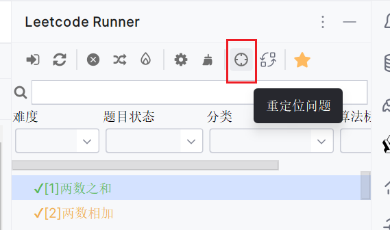

 
 

在插件使用的时候，可能出现如下情况。原本的code文件无法通过插件提供的编辑器形式打开，具体如下图所示

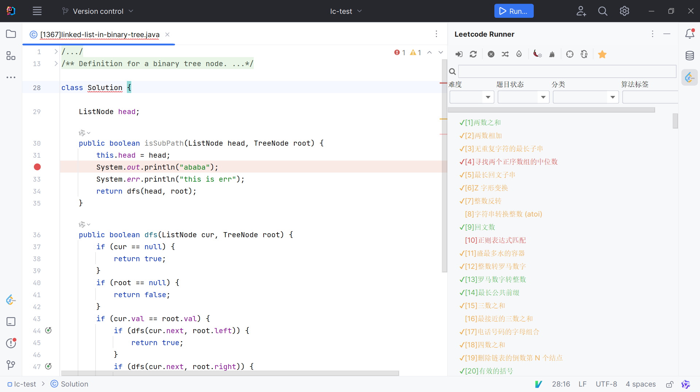

 
 

`Reposition`允许用户重新定位当前文件所代表的问题，重新加载文件，并通过插件提供的编辑器打开，同时定位到问题所在位置

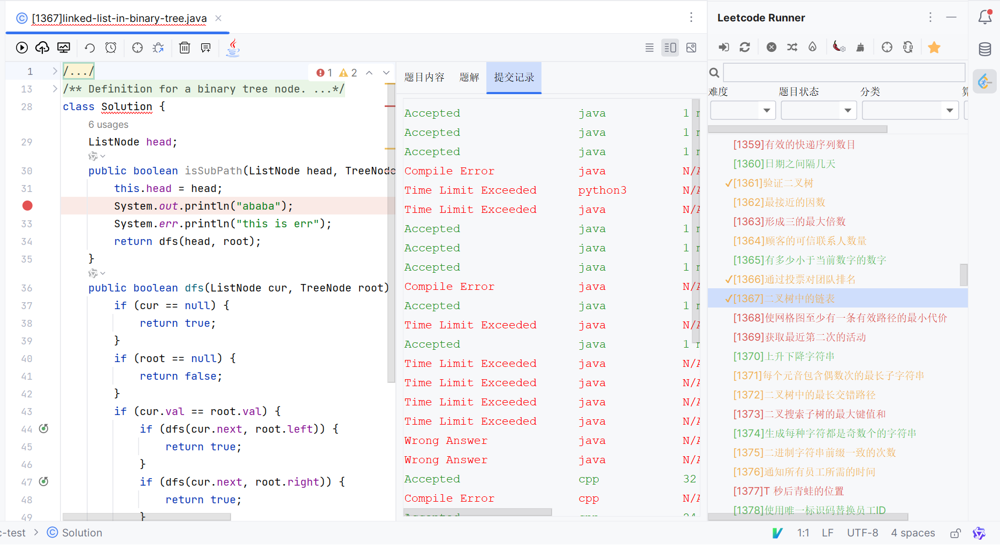

 
 

需要注意的是，Reposition的重定位功能底层需要关闭**用户已打开的当前文件**，**然后再创建新的文件**。之所以需要关闭+打开，其目的有2。1.重构缓存，2.重新打开才可以让idea通过Runner提供的editor显示题目

此处，对于创建新的文件就存在不同的选择

假设当前打开two-sum.py，但系统设置语言为Java。Runner在默认情况下会重新打开two-sum.py文件，而不是two-sum.java

但如果在系统设置中改变Reposition相关设置，则重新打开的文件可以是two-sum.java

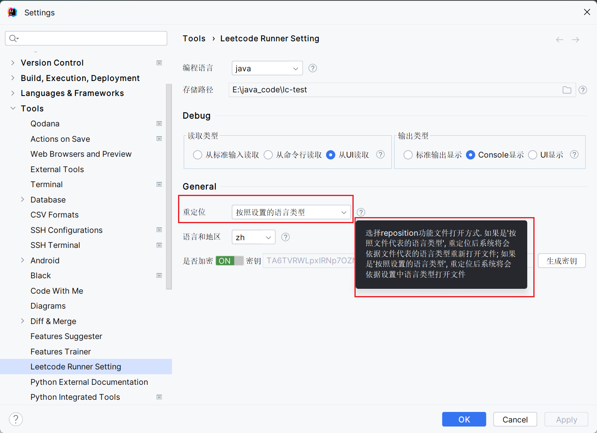

## submission界面

在大于等于2.6.4版本中，针对提交界面做出了优化，额外增加`显示错误信息`, `代码替换`，`新增测试样例`功能，具体如下

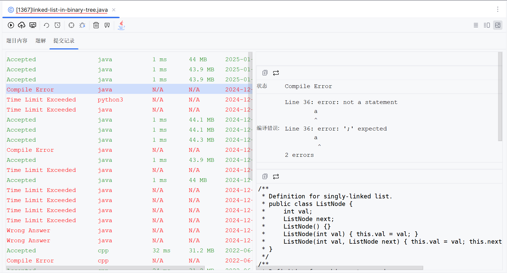

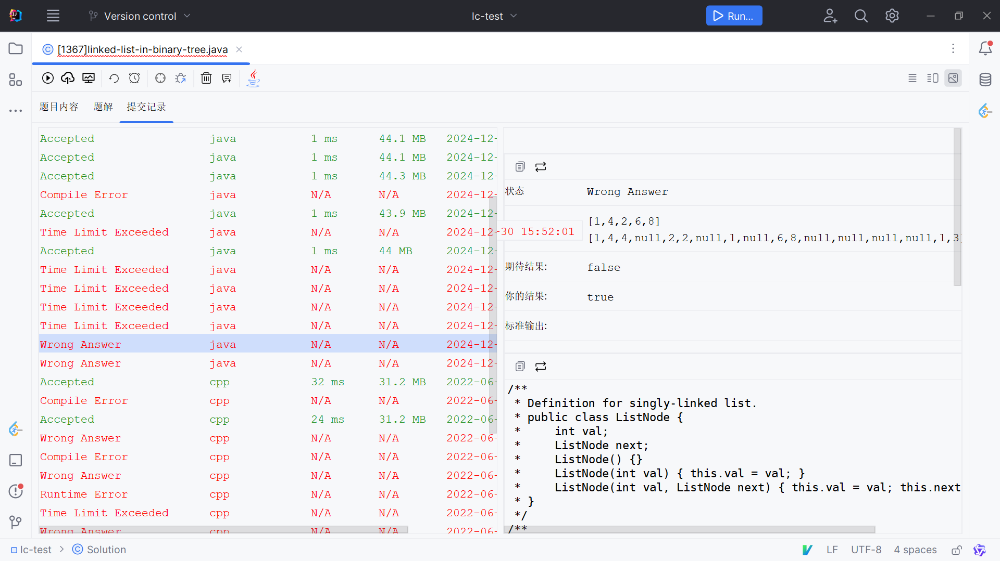

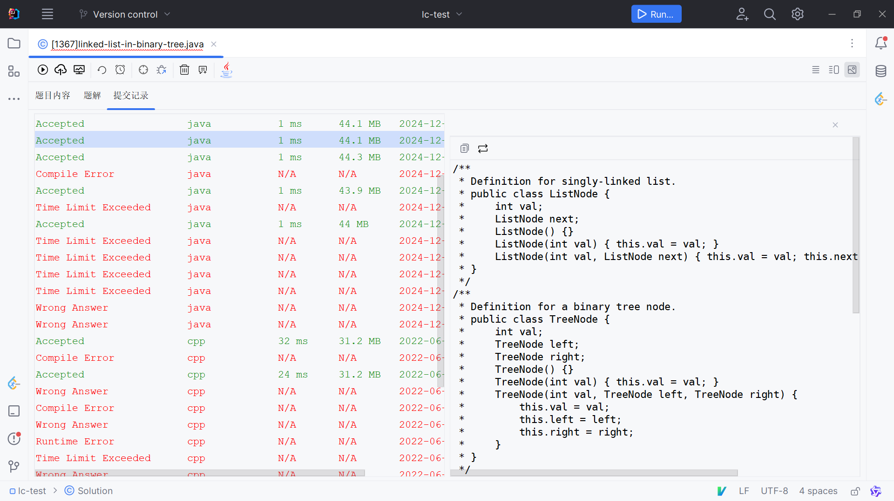

 

对于错误的提交记录，界面不仅显示历史代码，还会在Top栏显示错误原因，以及测试样例等信息

另外，大于等于v.2.6.4的版本允许用户直接替换代码，新增测试样例

 

## 代码cv/替换

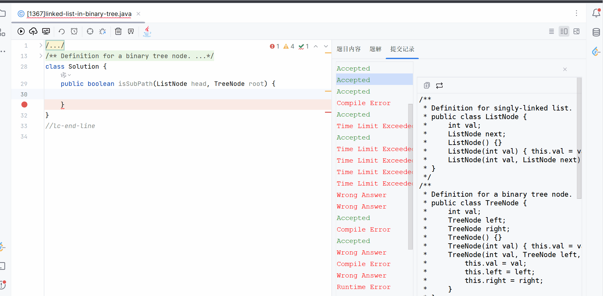

 
 

## 测试样例cv/新增

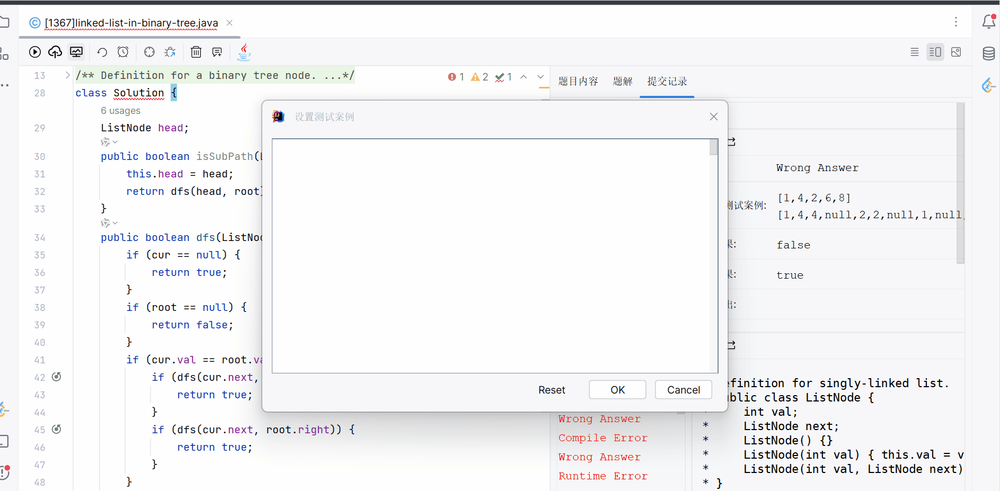

 

## 每日一题

点击按钮，将获得当天需要完成的每日一题，完成后系统会自动刷新图标，同时显示每日一题坚持天数，该功能也是作者常用的功能，桀桀

 
 

## 搜索 + 筛选功能

（再录制一次太麻烦了，README这块就用老版本的UI演示了）

## Debug

Debug模块是leetcode-runner提供的一个较为强大的功能。该功能允许用户无需任何操作，省去函数入口编写，测试案例转换等诸多繁琐的额外编码，直接对核心代码断点调试，且适用于绝大部分的leetcode题目。值得一提的是，市场上同类型的插件产品**都不支持对核心代码debug调试**，且该功能在leetcode官网使用需要付费

在3.5.0版本中，leetcode-runner支持Java、Python、C++的代码断点调试。支持`运行`, `step over`，`step into`，`step out`，`打印局部、成员、静态变量`，`表达式计算`，`表达式监视`，`执行代码高光`等诸多功能。并且支持标准输入读取、命令行读取、UI读取 + 标准输出显示、控制台显示 、UI显示等组合功能

> tip: C++不支持目标代码的标准输出+标准错误的捕获

[视频介绍链接](https://www.bilibili.com/video/BV15tc1eLEpa/)

### Debug设置

在使用Debug功能前，系统会进行配置检测。如果Debug配置为空，则会自动弹出设置界面，要求进行Debug配置

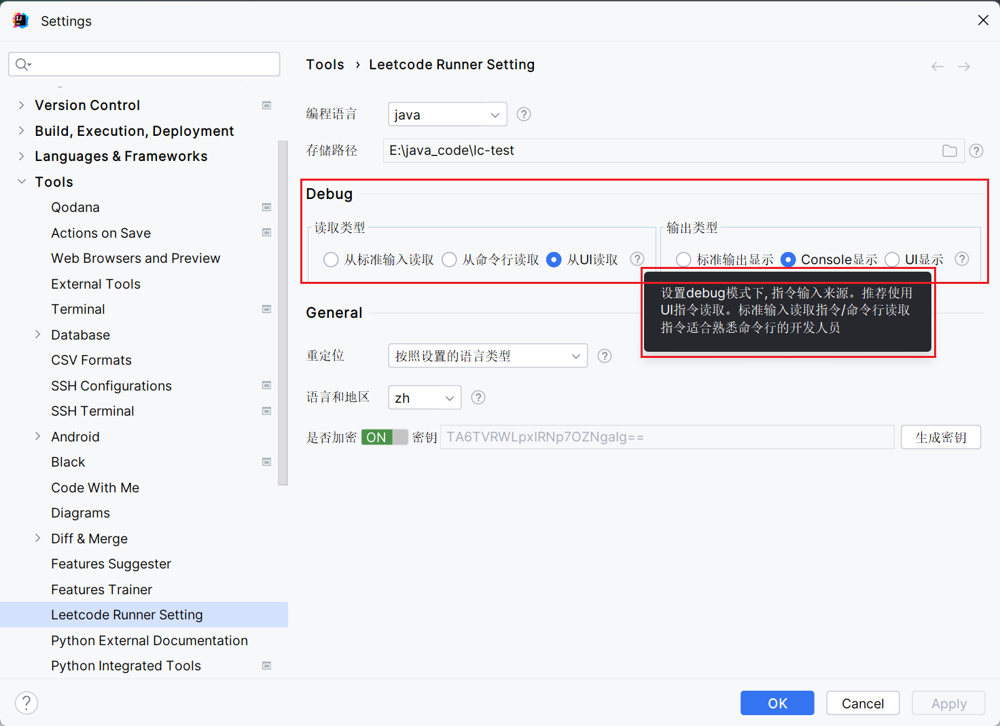

 
 

- read type
  - 设置Debug模式下, 指令输入来源。推荐使用UI指令读取。标准输入读取指令/命令行读取指令适合熟悉命令行的开发人员

- output type
  - 设置Debug模式下, 调试内容显示位置。推荐使用UI显示。标准输出显示/console显示适合熟悉命令行的开发人员

 

### 启动debug功能

点击Debug按钮，开启Debug功能

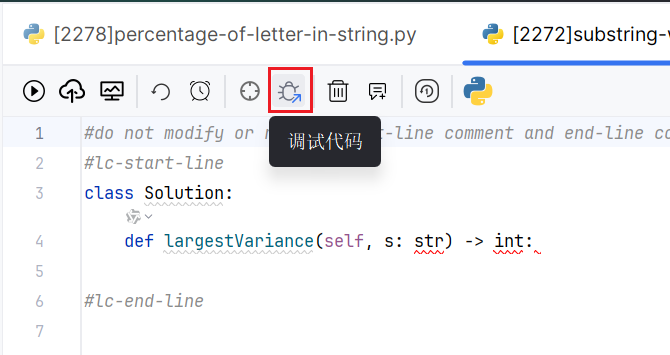

随后系统将会弹出引导对话框，要求用户进行必要的设置

#### Java目录选择

该选择要求用户指定debug启动的Java版本，指定Java目录后，系统会自动检测{home}\bin\java.exe是否存在

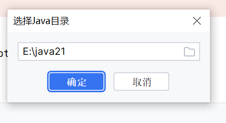

如果不存在，则会报错

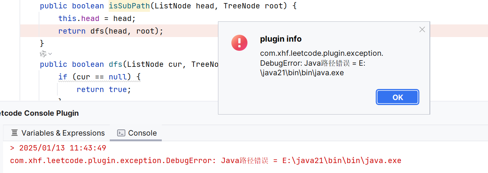

 

#### 测试案例选择

有关测试案例，系统只允许提供一轮的测试案例

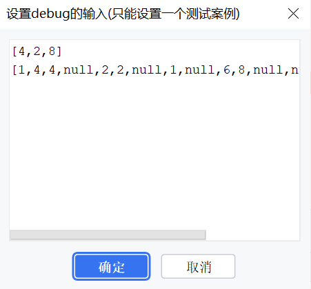

如果提供多轮，系统则会报错

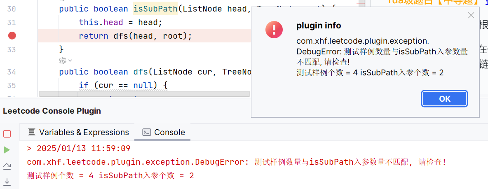

 

### debug成功

 

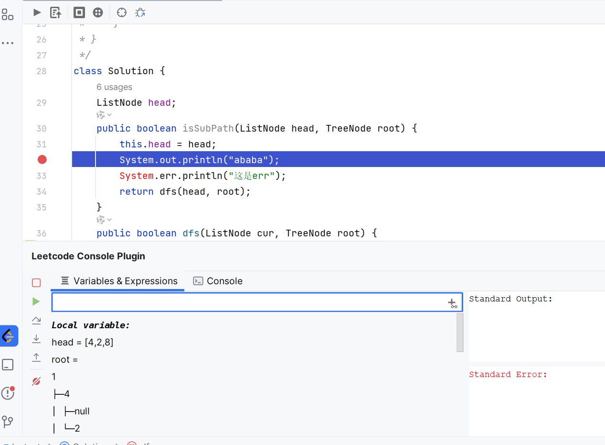

 

## 深度刷题

> 该功能在v3.6.0版本引入

Leetcode平台共有接近4000道题目，题目质量层次不齐，用户难以找到适合自己的题目。为了解决这一问题，Leetcode-Runner引入**深度刷题**功能，通过提供不同类型的优质题库，细分题目定位，为用户提供更高质量且符合用户当前水平的题目

该功能入口为如下图标

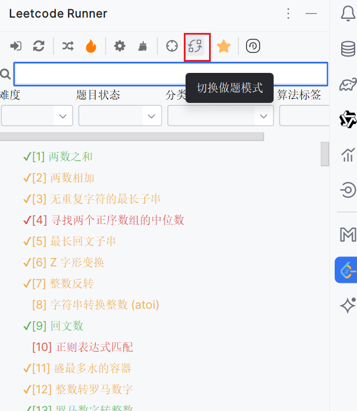

 
点击该按钮后，进入深度刷题模式

 
 

 

如果想要返回正常的刷题模式，再次点击该按钮即可

在深度刷题模式下，总共存在三类题库，分别是`Hot 100题`，`经典面试150题`，`LC-竞赛题`

在深度刷题模式下创建的题目会有更为丰富的编码界面，具体如下图标红区域

 

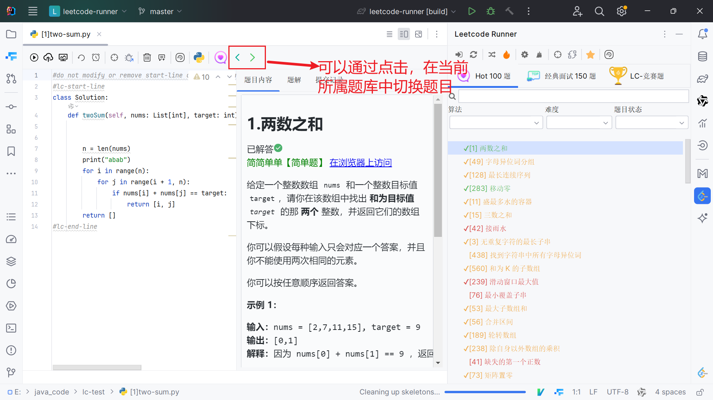

 

该功能具体演示如下：

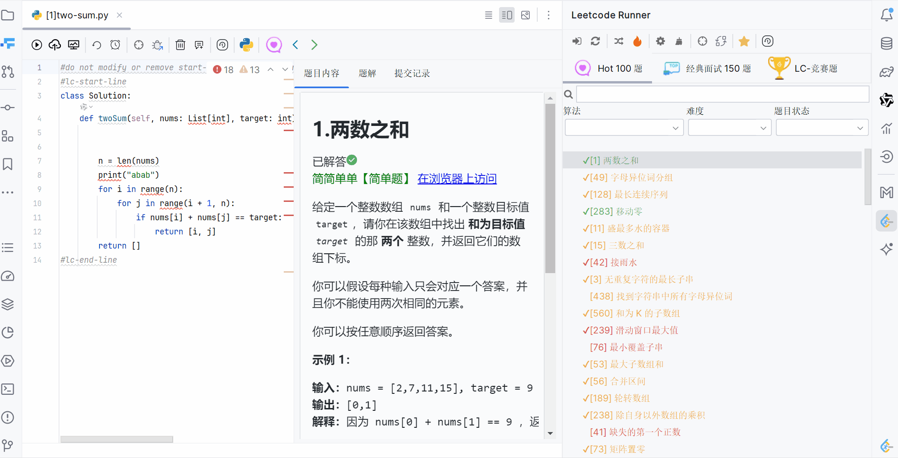

 
 

值得一提的是，在`LC-竞赛题`模式下，支持**灵神的题单**，如果你是一位leetcode刷题者，很难不了解灵神这位大佬，他的题解清晰明了，简单易懂，对每一位刷题者都有着极大的帮助

在Leetcode-Runner中，如果你想要查看灵神的题单，可以通过选择`灵神题单`下拉框选择的内容，点击后则会显示灵神题单

 
 

对于题单中存在的链接，Leetcode-Runner会进行跳转拦截，对于可以集成到Leetcode-Runner中的链接，系统则会提供打开方式，否则会通过Web浏览器打开

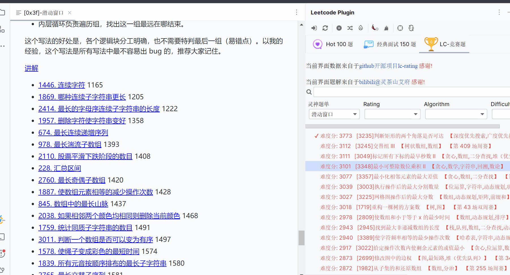

## 定时

点击闹钟按钮，出现`计时器`悬浮框，点击`开始`，则开始计时，点击`暂停`，则暂停计时，点击`重置`，则重置计时器

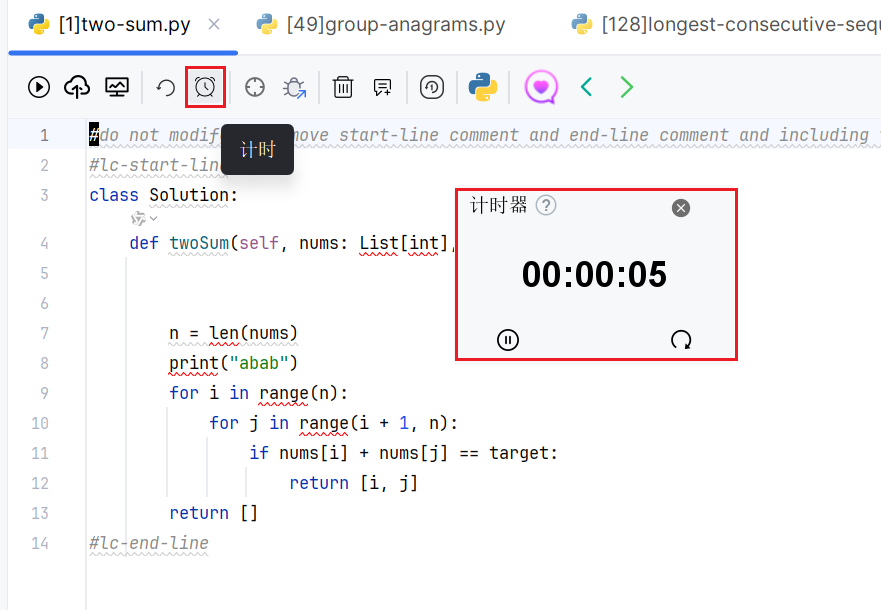

 

## 移除和添加注释功能

上述两个功能可以自动添加或删除Runner的注释，该注释圈定Runner提交给Leetcode的代码区域，因此Runner的注释对于系统的正常运行起到关键作用

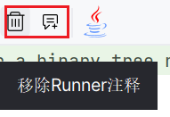

 

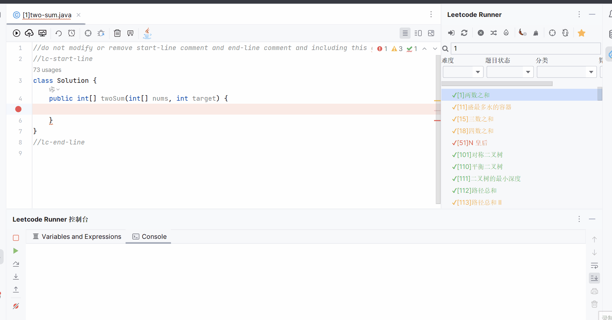

## 自动题目规划

该功能还在开发中，预计在v3.7.0版本中上线，敬请期待
