使用Leetcode-Runner遇到BUG？莫慌！百分之99的BUG都可以这样解决

1. 点击清除缓存按钮

 

2. 点击确认

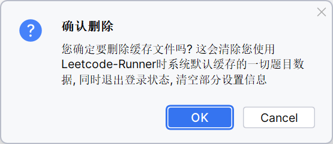

 
3. 重启IDE

 
 
4. 重启电脑(如果还没解决)

 

请相信我，99%的BUG都可以这样解决，没有什么是`重启`解决不了的，如果有，那就再重启一次

如果觉得上述操作很麻烦，可以参考下文给出的特定解决方案

如果这样样还是没有解决，那么恭喜你，发现了一个野生的未知BUG，将这沟槽的玩意儿发给我们，我们会尽快fix，如果在我们能力范围之内的话

 

 

### 1.题目内容没有以markdown形式呈现

 
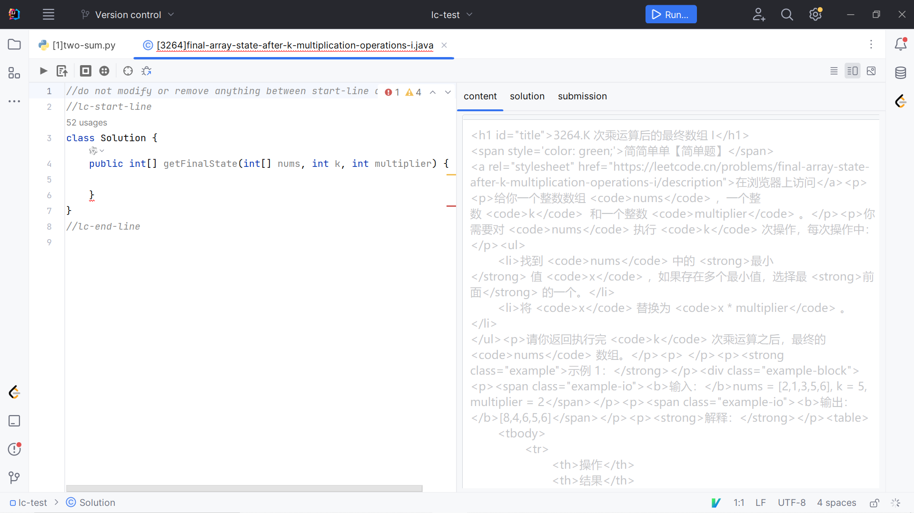

点击solution或者submission, 然后再切换回content. 如果html还未渲染完毕, 可通过Reposition功能重新打开

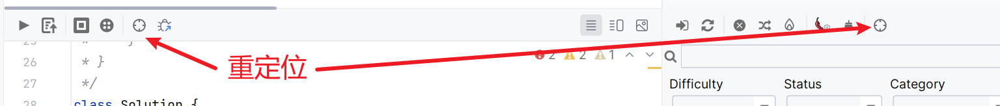

 

### 2. 过滤得不到任何题目

 

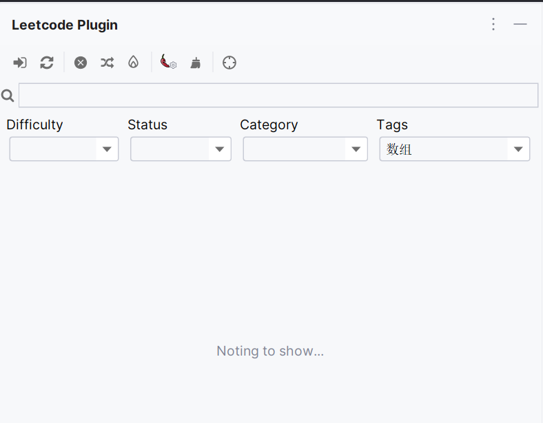

点击reload question，重新查询题目

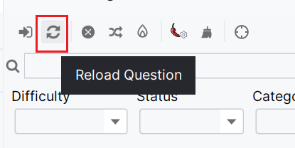

 

### 3. Cpp debug 文件编译错误

 

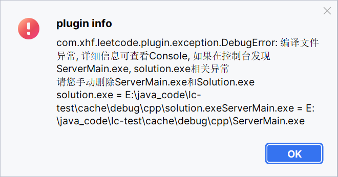

 

该问题在**v3.5.0**增加cpp debug功能时引入，其产生原因是c++debug server没有正常退出，导致**ServerMain.exe**，**solution.exe**所在进程并未被正常销毁
作者目前也在尝试着解决这个问题，但并未提供一个安全的解决方案
此时需要用户手动杀死相关进程，关于solution.exe，ServerMain.exe所在路径会在console中显示，具体如下

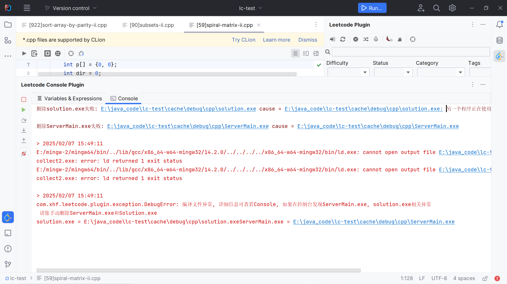

进入console显示的目录，尝试删除文件，发现删除失败

 

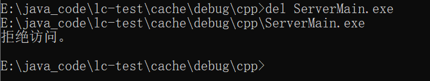

这是因为ServerMain.exe被C++进程持有，需要先杀死对应进程，才能删除文件
**杀死占有.exe的进程**

- 方案一：

  在终端输入`tasklist | findstr ServerMain.exe`，得到的第二个输出就是ServerMain.exe启动程序占用的端口
  然后通过`taskkill /F /PID {端口}`杀死进程，即可终止占用ServerMain.exe的程序
  此时可以删除ServerMain.exe
  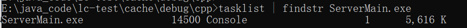

- 方案二：
  重启电脑，通过重启强制杀死所有的程序，此版可以删除ServerMain.exe

### 4. vm 连接失败

 

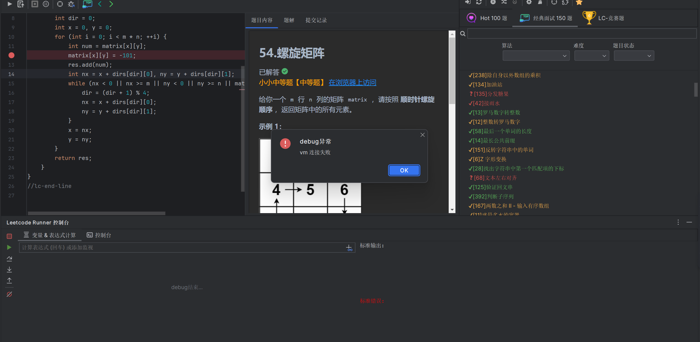

导致该错误的原因有两种

1. debug启动时设置的jdk版本过低
2. std_log.log和std_err.log被其他文件占用

如果是原因1，可选择启动低版本的jetbrains或者选择高版本的jdk，当然最保险的方式还是选择jetbrains自带的jdk，jetbrains产品自带的jdk路径为`${安装目录}\jbr\bin\java.exe`，比如`D:\PyCharm 2024.1.3\jbr\bin\java.exe`

需要说明的是，在debug阶段开始前的填写路径阶段，请不要输入完整路径，而是输入根路径，比如`${安装目录}\jbr`，系统会自动添加`\bin\java.exe`

值得一提的是，在3.6.4版本中，Leetcode-Runner通过改变JVM启动策略从而解决因为jetbrains版本过高而无法启动低版本jdk的问题

如果是原因2，用户会在console控制台中看到std_log.log和std_err.log两个文件的路径

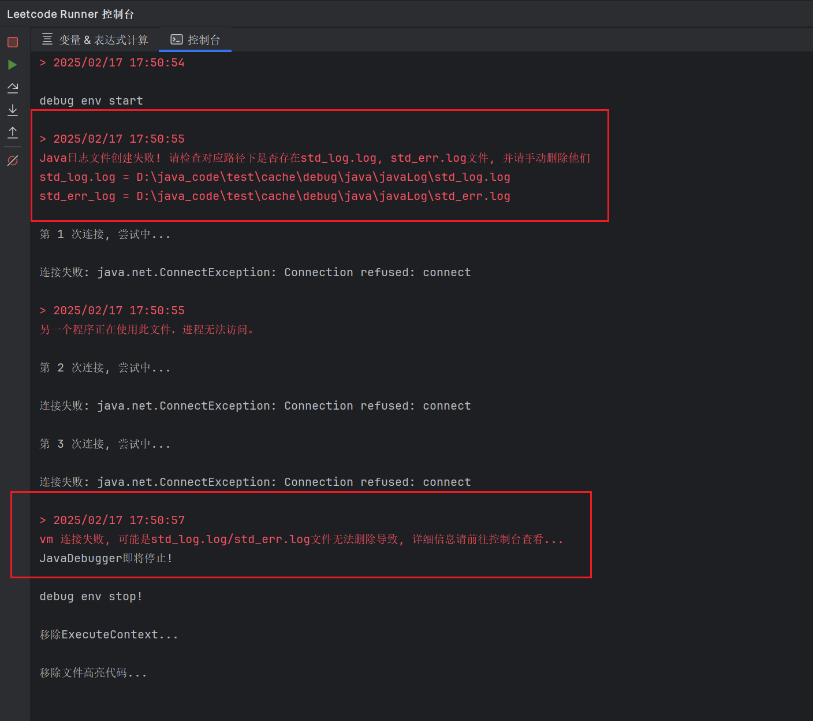

如果尝试删除, 则会出现**文件已被占用的报错**

此时需要采取强制手段删除

可以选择重启，又或者选择杀死占用文件的进程，具体操作如下：

在任务管理器中打开资源监视器

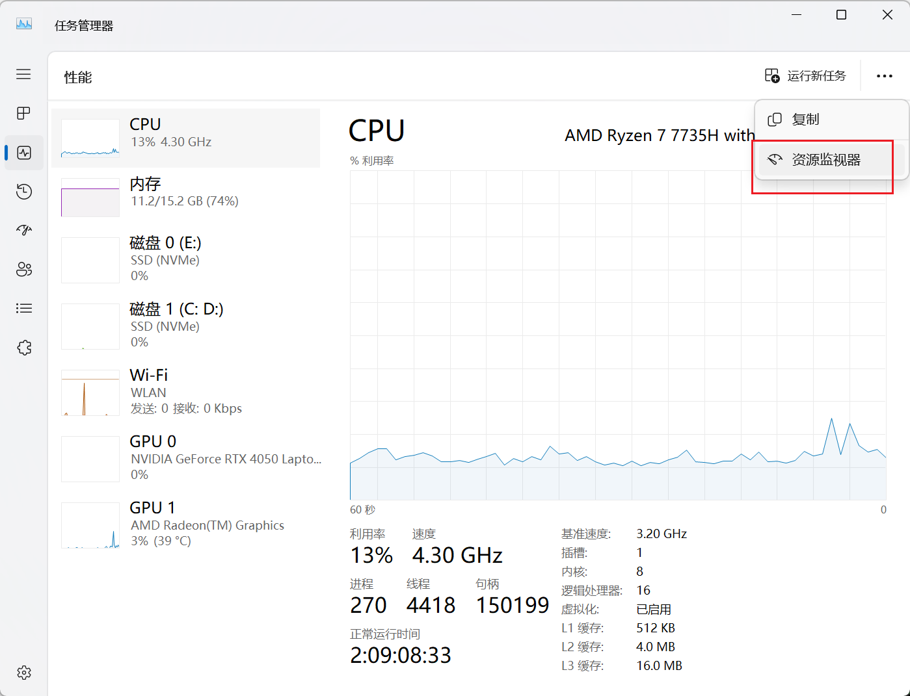

在资源监视器中选择`CPU`，在关联的句柄中搜索`std_log.log`，找到相关程序，并将其杀死

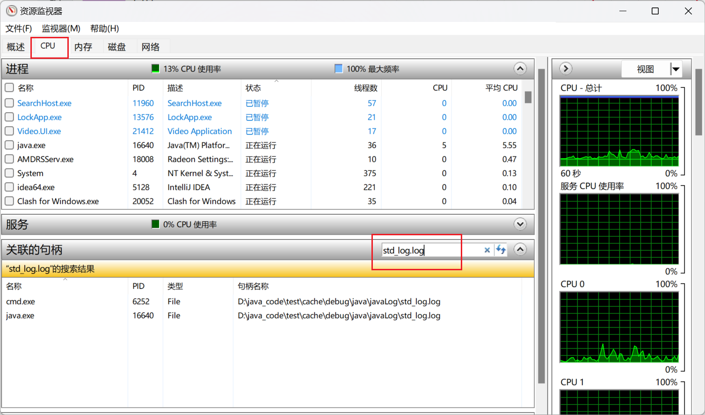

 

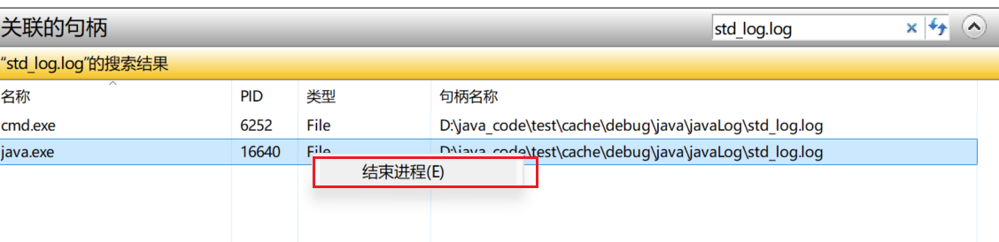

切忌将系统级别的重要进程终结，在终结进程前请确认句柄名称！！！

### 5. Android Studio出现JCEF登录失败

 

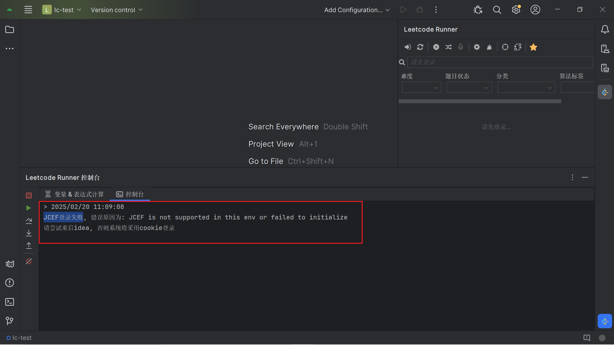

解决方法
Android studio Go to Help -> Find action

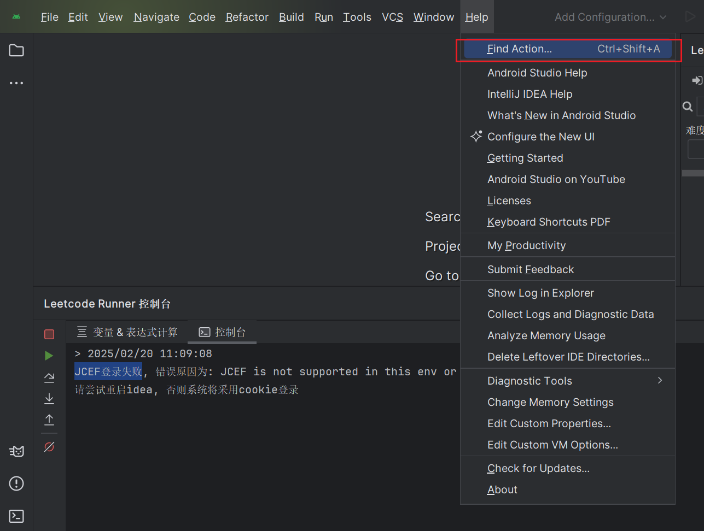

搜索 Choose Boot Java Runtime for the IDE

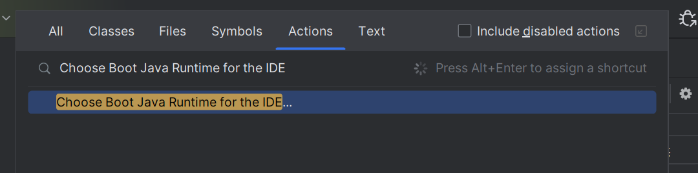

选择JCEF运行的JDK

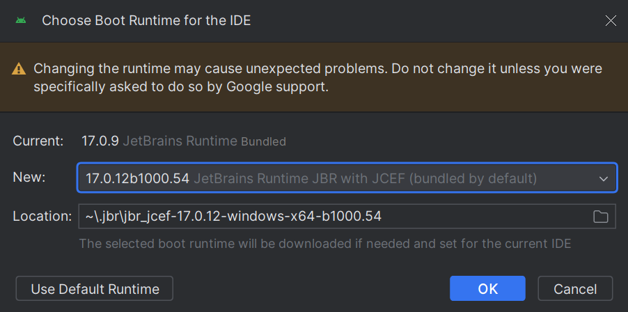

确认，等待idea下载即可

### 6. 题目内容显示为空

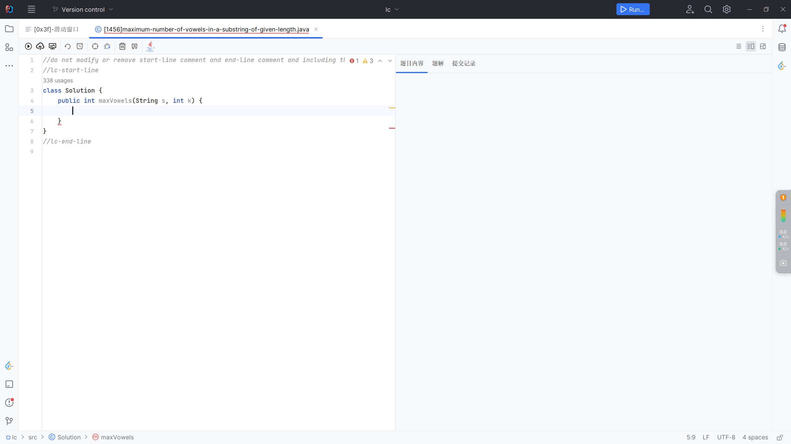

点击重定位按钮，进行文件内容刷新

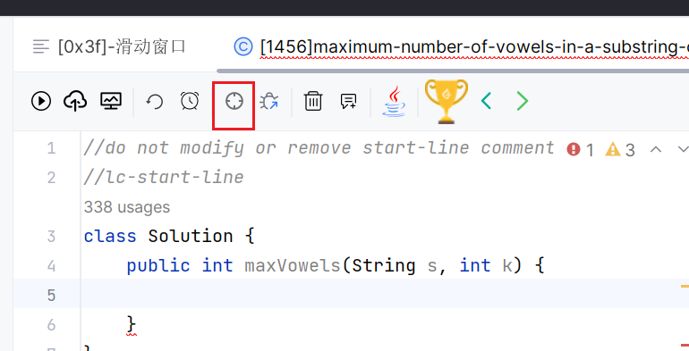

重定位后，内容可以重新显现

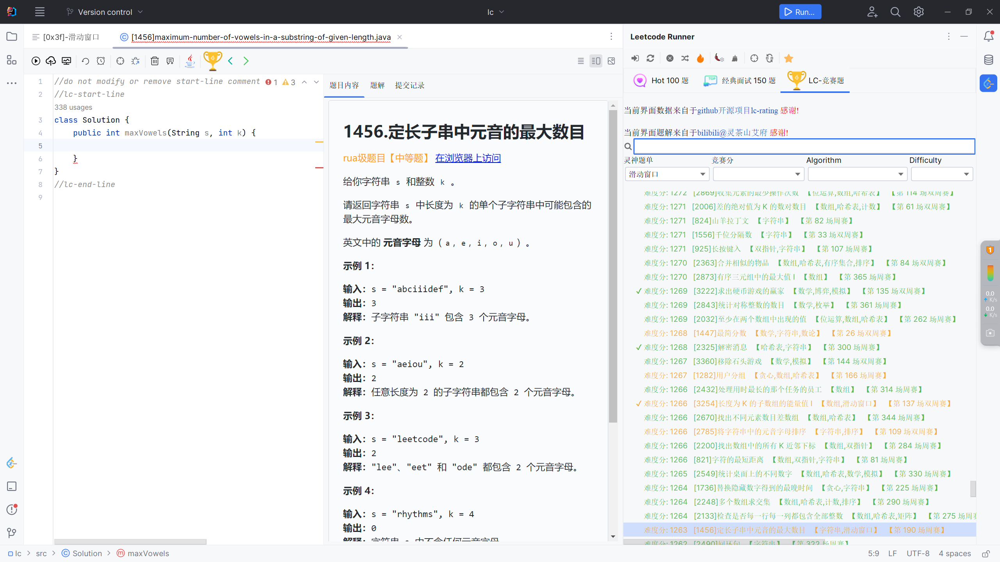

### 7. 灵神提单界面显示空白？

通过deep coding入口打开灵神提单，正常情况下会显示文字内容

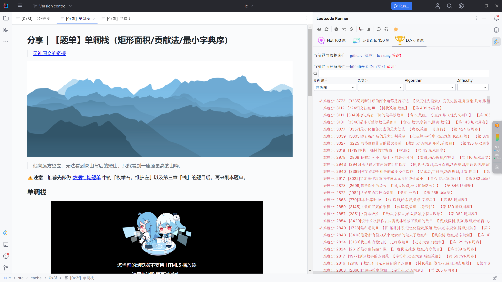

但再特殊情况下，比如打开多个文件，同时反复切换，可能会导致其中的某些题解无法正常显示

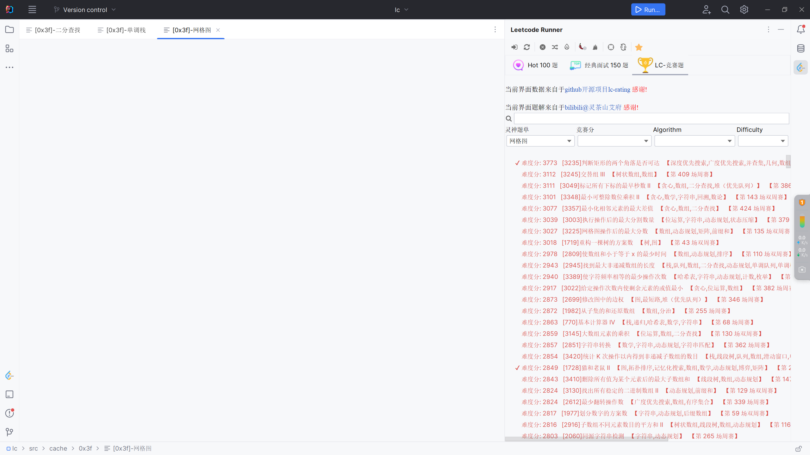

这时可以使用reposition重定位功能，重新打开当前文件。值得一提的是，reposition在大于v3.6.7版本才支持重定位灵神题解

### 8. 网络错误

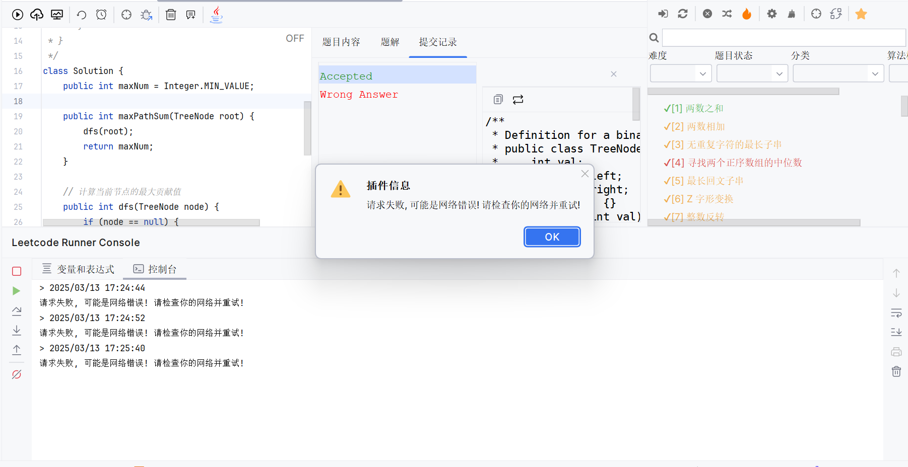

在v3.6.8版本后，Leetcode-Runner对于网络监测比较严格。

在早期版本中，如果用户网络异常，可能会导致整个系统阻塞，再次期间用户无法使用IDE的任何功能，且过了很长时间后才会抛出异常。

为了优化这一体验，在3.6.8版本中加强对于网络能力的检测。如果2s内已然无法建立TCP连接，则显示提醒用户网络异常

如果用户检测网络后发现能够正常请求，但Leetcode-Runner已然抛出网络异常的bug，可以等待2-3s，再执行操作

### 9. 右侧主Window加载异常
 
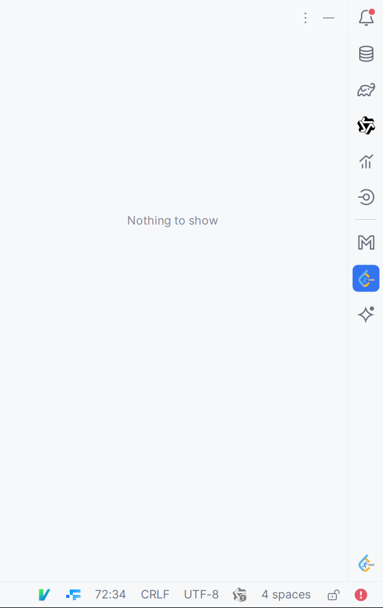

 
出现这种情况，多半是右侧主界面加载时出现网络异常，导致无法正常加载。重启IDE即可解决

### 10. 不同IDE使用同一个存储路径, 其中一个IDE显示登录, 但别的IDE显示未登录

假如A IDE存储路径是D:/java。B IDE存储路径是D:/java。

此时A IDE登录成功, 但B IDE显示未登录。

可能是因为A IDE登陆成功后，用户开启了`加密`功能，导致A对对缓存数据进行了加密。A，B IDE使用的密钥不同，导致A能解密的数据，B无法解密

解决方法是，登录A IDE后，关闭`加密`功能，再登录B IDE即可。

### 11. 系统创建代码文件失败

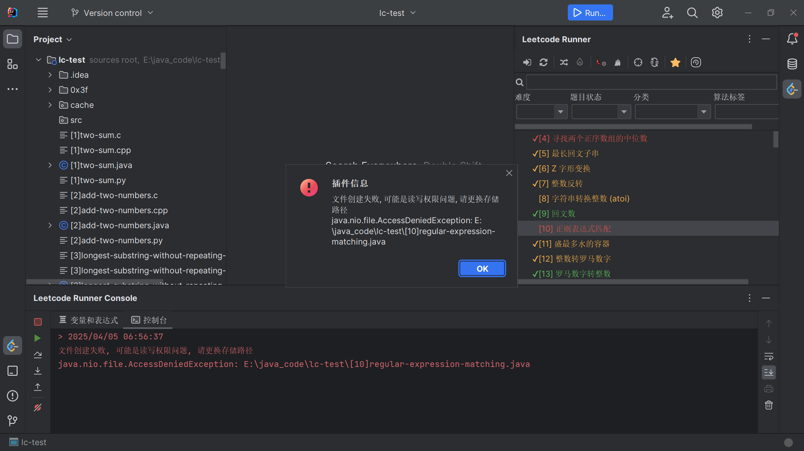

> tip: 在v3.7.0以前, 文件创建失败不会显示报错对话框. 而是在右下角出现error提示。点击后出现IDE Internal Error对话框。
> 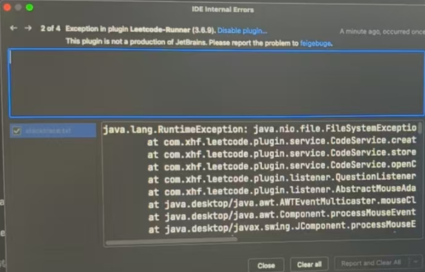

这大概率是因为`存储路径`所代表的文件夹是个只读文件夹，Runner系统没有`写权限`。可以选择修改存储路径，或者修改存储路径所代表的文件夹的权限。

更改存储路径只需要在设置中修改信息，而更改文件夹权限可参考接下来的内容

右键点击所选目录，选择`属性`

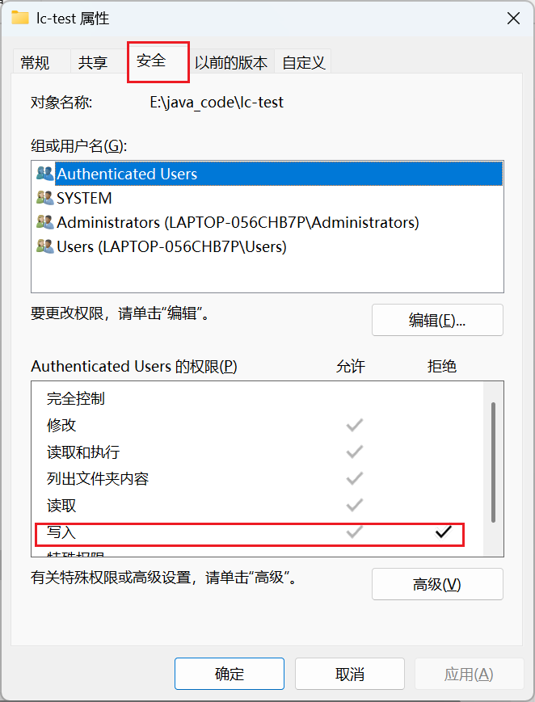

点击`安全`, 修改写权限

### 12. 插件第一次启动并登录成功，但是第二次启动IDE却发现未登录，且题目数据全部丢失

出现这种情况可能有两种原因

1. 缓存文件被删除
2. 缓存文件无法被正确存储（存储路径无法写入文件）

如果是缓存文件被删除，可以尝试重新登录，如果还是没有解决，可以尝试重新安装插件

如果是存储路径错误，需要用户点击`清除缓存`按钮，然后重新选择存储路径

之所以需要点击清除按钮，是因为Runner只会将用户第一次设置的`存储路径`记录为**缓存文件**写入的路径，如果想要更换，必须点击`清除缓存`。这样就可以清空`系统记录的缓存文件写入路径`，进行重新赋值

